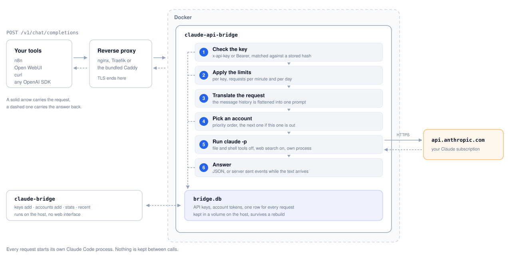

# Claude API Bridge

Serve your personal Claude subscription behind an OpenAI compatible API.

Most tools speak the OpenAI format. A Claude subscription does not, and a
subscription token has no quota on the official API. What a subscription does
open is Claude Code as a process. This service sits in between: it takes a
normal OpenAI chat request, runs Claude Code with it, and returns the answer in
the OpenAI shape.

Nothing here is reverse engineered. It calls Anthropic's own tool with your own
login.

<picture>
  <source media="(prefers-color-scheme: dark)" srcset="docs/architecture-dark.svg">
  
</picture>

## What it is

- One container on your own server.
- Two endpoints, `POST /v1/chat/completions` and `GET /v1/models`.
- Several API keys, one per tool, each with optional limits.
- Several Claude accounts, tried in order, with automatic fallback.
- Usage statistics on the command line. No web interface, no login page.

## What it is not

- Not a shared service. One person, one subscription.
- Not a drop in replacement for the Claude API. Tool calling and structured
  output are rejected rather than faked.
- Not free of terms. You are responsible for how you use your own subscription.

## Requirements

- A Linux server with Docker and the compose plugin.
- A Claude subscription, and a machine where you are logged in to Claude Code.

## Install

```bash
git clone https://github.com/dmnrxb/claude-api-bridge.git
cd claude-api-bridge
sudo ./install.sh
```

The installer asks four things: the port, how the service should be reached,
your Claude token, and nothing else. It writes the configuration, builds the
image, starts the container and installs the `claude-bridge` command.

For how it is reached you get three options:

1. **You already run a reverse proxy.** The bridge binds to `127.0.0.1` and the
   installer prints an nginx block you can paste in. Also in
   [docs/nginx.conf.example](docs/nginx.conf.example).
2. **Set up TLS for me.** Caddy runs alongside and gets a certificate. Needs a
   domain pointing at the server and ports 80 and 443 free.
3. **Plain HTTP on a port.** For a private network, a VPN or an SSH tunnel.

To remove everything again:

```bash
sudo ./install.sh --uninstall
```

## Prebuilt image

`install.sh` builds the image on your server. That takes a couple of minutes
and always gets the newest Claude Code.

If you would rather not build, there is a published image. It is rebuilt every
night, so it is current but not always newest:

```
ghcr.io/dmnrxb/claude-api-bridge:latest
```

To use it, swap the `build:` block in `docker-compose.yml` for the image:

```yaml
services:
  bridge:
    image: ghcr.io/dmnrxb/claude-api-bridge:latest
```

Update it with `docker compose pull && docker compose up -d` instead of
`claude-bridge rebuild`.

## The token

Claude Code needs a login. A server has no browser, so create a token on a
machine where you are already signed in:

```bash
claude setup-token
```

Paste the result into the installer, or add it later:

```bash
claude-bridge accounts add primary
```

The token is typed hidden, encrypted before it reaches the database, and never
appears in a log line.

On macOS the normal login lives in the keychain, not in `~/.claude`. Mounting
that folder into a container gives you `Not logged in`. The token is the way
around that.

## Use it

Point any OpenAI client at your base URL.

```bash
curl https://bridge.example.com/v1/chat/completions \
  -H "Authorization: Bearer cb-your-key" \
  -H "content-type: application/json" \
  -d '{"model":"claude-opus-5","messages":[{"role":"user","content":"hello"}]}'
```

Python:

```python
from openai import OpenAI

client = OpenAI(base_url="https://bridge.example.com/v1", api_key="cb-your-key")
answer = client.chat.completions.create(
    model="claude-opus-5",
    messages=[{"role": "user", "content": "hello"}],
)
print(answer.choices[0].message.content)
```

Full endpoint reference: [docs/api.md](docs/api.md).

## The command

```
claude-bridge status                       what is configured, and today's numbers
claude-bridge stats --days 30              usage by key, model, account and day
claude-bridge recent -n 20                 the last requests

claude-bridge keys add n8n --rpm 20 --rpd 500
claude-bridge keys list
claude-bridge keys limit n8n --rpd 1000
claude-bridge keys disable n8n
claude-bridge keys rm n8n

claude-bridge accounts add work --priority 10
claude-bridge accounts list
claude-bridge accounts token work          replace an expired token
claude-bridge accounts reset               clear every cooldown

claude-bridge start | stop | restart | logs -f
claude-bridge rebuild                      rebuild with the newest Claude Code
claude-bridge update                       pull the repo, then rebuild
claude-bridge version                      bridge and Claude Code versions
```

Changes take effect at once. The command and the service share the same
database, so there is nothing to reload.

```
$ claude-bridge stats --days 7

Last 7 days

  requests        1,204
  served          1,191
  failed             13
  input tokens  4,912,880
  output tokens   318,004
  reported cost   $41.22
  average time    8,412 ms

By key
  name       requests  in         out      cost
  ---------  --------  ---------  -------  ------
  n8n             812  3,201,004  204,881  $27.90
  open-webui      392  1,711,876  113,123  $13.32
```

## Staying current

The image is built with whatever Claude Code is newest at build time. The
version number is resolved on the host first, so the build stays repeatable and
`claude-bridge rebuild` really does fetch a new release.

```bash
claude-bridge rebuild
claude-bridge version
```

To stay on one version, put it in `.env`:

```
CLAUDE_CODE_VERSION=2.1.278
```

## Several accounts

Accounts are tried in priority order, lowest number first. Within the same
priority the one used longest ago goes next.

When a run fails because of the account, on a usage limit, a rate limit or a
token that no longer works, that account is parked for fifteen minutes and the
same request is handed to the next one. The caller sees one answer and never
learns that a switch happened.

A failure that is not the account's fault, a prompt that is too long for
example, stops right there. Retrying it elsewhere would only burn a second
account.

```bash
claude-bridge accounts add main --priority 10
claude-bridge accounts add spare --priority 20
claude-bridge accounts list
```

## Configuration

Settings live in `.env` next to `docker-compose.yml`. Change a value and run
`claude-bridge restart`.

| Variable | Default | |
|---|---|---|
| `BRIDGE_PORT` | `8787` | port on the host |
| `BRIDGE_BIND` | `127.0.0.1` | which address the port binds to |
| `BRIDGE_SECRET_KEY` | | encrypts the account tokens, written by the installer |
| `BRIDGE_DEFAULT_MODEL` | `claude-opus-5` | used when a request names no model |
| `BRIDGE_UNKNOWN_MODEL` | `map` | `map` falls back to the default, `error` answers 400 |
| `BRIDGE_MAX_CONCURRENT` | `4` | Claude Code processes at the same time |
| `BRIDGE_QUEUE_TIMEOUT_MS` | `30000` | how long a request waits for a free slot |
| `BRIDGE_REQUEST_TIMEOUT_MS` | `600000` | hard stop for one run |
| `BRIDGE_ACCOUNT_COOLDOWN_MS` | `900000` | how long a failed account is parked |
| `BRIDGE_RETENTION_DAYS` | `90` | how long request rows are kept, `0` keeps them |
| `BRIDGE_LOG_LEVEL` | `info` | `error`, `warn`, `info` or `debug` |
| `CLAUDE_CODE_VERSION` | `latest` | which CLI to build with, or a version to pin |

## Security

The service holds a token for someone's subscription and its prompts do not
always come from a trusted place. A few things follow from that.

**The tools are locked down twice.** `Bash`, `Read`, `Write`, `Edit`, `Glob`
and `Grep` are on the deny list. Without that, text in a prompt could ask for a
shell, read the environment, and walk out with the token. `WebSearch` and
`WebFetch` are on the allow list because they only read. Leaving them off both
lists is not enough: in headless mode Claude Code asks for permission, gets no
answer, and then tells the caller it was not allowed to search.

**Nothing runs as root.** The container uses the `node` user on a port above
1024, writes no file outside its volume and installs nothing at runtime.

**Nothing is open by default.** The published port binds to `127.0.0.1` unless
you choose otherwise, and the service refuses to start without a secret key.

**Tokens are encrypted at rest** with a key from `.env`. That protects the
database file, a backup or a stray volume mount. It does not protect against
someone who can already read `.env` on the host.

**API keys are stored as a hash.** A key is shown once when it is created and
cannot be recovered afterwards. Lost one, make a new one.

Found a problem? See [SECURITY.md](SECURITY.md).

## What does not pass through

| | |
|---|---|
| text in, text out | works |
| streaming | works, as server sent events |
| web search | works, through Claude Code's own tool |
| `tools`, `functions` | rejected with 400 |
| `response_format`, structured output | rejected with 400 |
| images, audio, files | rejected with 400 |
| `max_tokens` | read, then ignored, the CLI has no flag for it |

Two more things worth knowing:

- The system message replaces Claude Code's own system prompt instead of adding
  to it. That takes the coding harness out of a plain chat.
- Claude Code sends its own system prompt with every call, several thousand
  tokens. Anyone converting the token counts into money gets a higher number
  than a bare API call with the same prompt would give.

## Development

No dependencies. Node 24 or newer, because `node:sqlite` is what the storage
uses.

```bash
npm test    # offline, no network and no Claude account needed
```

Running the service locally:

```bash
export BRIDGE_SECRET_KEY="$(openssl rand -base64 48)"
export BRIDGE_DATA_DIR=./data
node src/cli.mjs keys add local
node src/server.mjs
```

The layout:

```
src/server.mjs     HTTP, routes, streaming
src/claude.mjs     builds the arguments, runs the process, reads its output
src/openai.mjs     request validation, prompt flattening, response shapes
src/accounts.mjs   account pool and fallback
src/auth.mjs       key lookup and limits
src/queue.mjs      how many runs at once
src/store.mjs      SQLite
src/cli.mjs        the claude-bridge command
```

[CONTRIBUTING.md](CONTRIBUTING.md) has the rest.

## License

MIT. See [LICENSE](LICENSE).

Not affiliated with Anthropic. Claude is a trademark of Anthropic, PBC.
